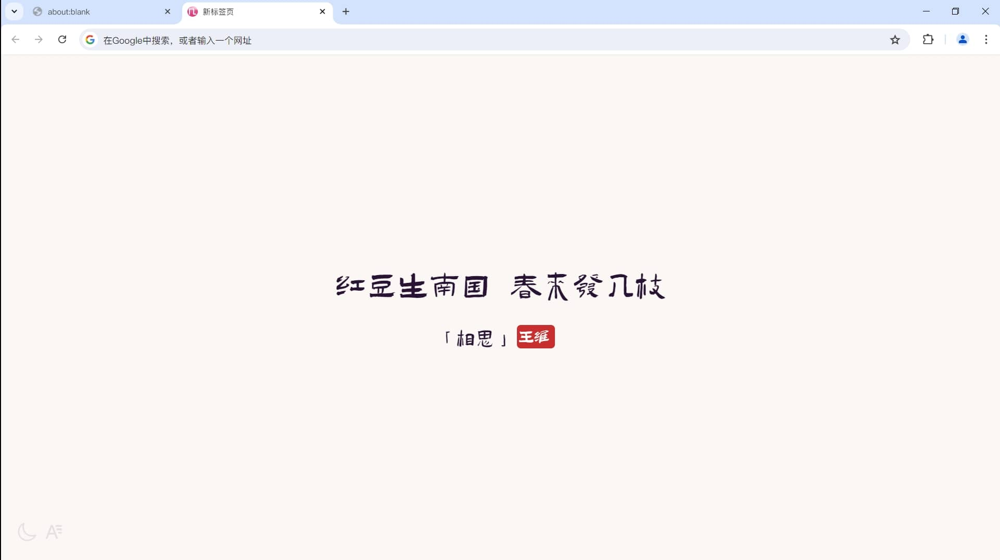
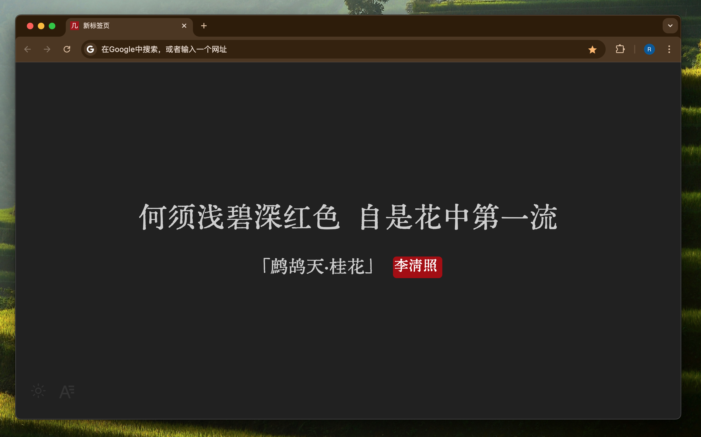

# 几枝·夏

## 介绍

支持自定义新标签页的跨浏览器扩展，几枝夏将在新标签页上展示中国经典诗词。

## 特性

- 使用完全离线的数据、字体，无需联网
- 保持简洁、美观的设计风格
- 使用 WXT + React + Tailwindcss + Daisyui 开发

## 使用说明

左下角的按钮可以切换主题、切换字体。

### 下载安装

#### 商店下载链接：

> Chrome、Firefox、Edge 等浏览器商店点击下面图标或链接下载，或直接在浏览器拓展商店搜索 “几枝夏” 安装。

<p align="center">
  <a
    rel="noreferrer noopener" target="_blank" target="_blank"
    href="https://chromewebstore.google.com/detail/%E5%87%A0%E6%9E%9D%E5%A4%8F/aihpjpjndpdkbmdjghjglbmippnjlkcp"
    ></a>
  <a rel="noreferrer noopener" target="_blank" href="https://addons.mozilla.org/zh-CN/firefox/addon/%E5%87%A0%E6%9E%9D%E5%A4%8F/"
    ></a>
  <!-- <a rel="noreferrer noopener" target="_blank" href=""
    ></a>
  <a
    rel="noreferrer noopener" target="_blank"
    href=""
    ></a>
  <a el="noreferrer noopener" href=""
    ></a> -->
</p>

- [Chrome Web Store](https://chrome.google.com/webstore/detail/aihpjpjndpdkbmdjghjglbmippnjlkcp)（Chrome、Edge、Opera、Brave、360、Safari 等使用）

- [Firefox Addons](https://addons.mozilla.org/zh-CN/firefox/addon/%E5%87%A0%E6%9E%9D%E5%A4%8F/)（Firefox、Waterfox 等使用）

Releases 预构建下载：安装包太大，GitHub Releases 无法上传，请耐心等待后续更新网盘下载链接或自行本地构建。

## 预览




#### 本地构建

> 依赖：Node.js、Bun(or pnpm)

```bash
git clone https://github.com/xxnuo/jizhi-mod.git
cd jizhi-mod
bun install
bun run zip:all
```

构建成功后浏览器直接加载 .output 文件夹下对应浏览器的拓展文件为 “加载解压缩的拓展”。

## 后续计划

- [ ] 安装包体积有点大，考虑后续将字体改为网络加载，使用 CDN 加速保证不影响加载速度。

## 鸣谢

界面样式模仿了 [unicar9/jizhi](https://github.com/unicar9/jizhi)，感谢作者的优秀作品。

字体来自 [中文网字计划](https://chinese-font.netlify.app/)，有许多优秀的中文字体。
