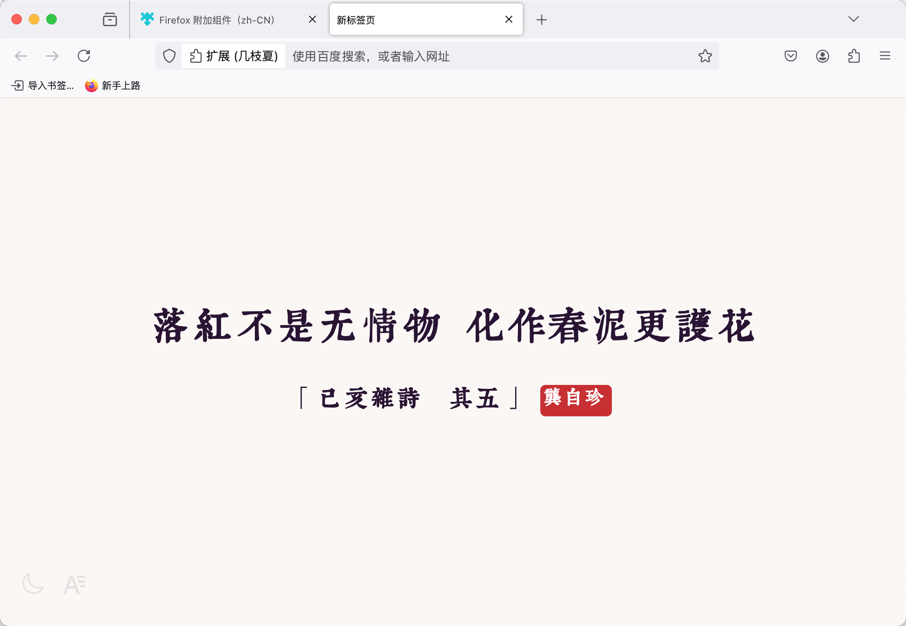

# 浮生梦

  
  
  
  

## 介绍

支持自定义新标签页的跨浏览器扩展，浮生梦将在新标签页上展示中国经典诗词。

### 目前已完成的功能

- 点击诗句自动朗读
- 具有多种风格迥异的字体
- 支持自动切换明暗主题

有空会持续更新新功能，目前只是基础 1.0 版本。

## 预览

<!-- https://i.imgur.com/qc5QtNM.png -->

<!-- https://i.imgur.com/Z8A47Rd.png -->

<!-- https://i.imgur.com/fQgS52Q.png -->

<!-- https://i.imgur.com/ucGvozQ.png -->

## 特性

- 使用完全离线的数据，无需联网
- 保持设计风格：简洁美观第一，速度性能第一（针对低功耗设备优化）
- 使用 WXT + React + Tailwindcss + Daisyui 开发

### 下载安装

#### 商店下载链接：

> Chrome、Firefox、Edge 等浏览器商店点击下面链接或标题的图标下载，也可以直接在浏览器拓展商店搜索 “浮生梦” 安装。

- [Chrome Web Store](https://chrome.google.com/webstore/detail/aihpjpjndpdkbmdjghjglbmippnjlkcp)

- [Firefox Addons](https://addons.mozilla.org/en-US/firefox/addon/jizhi-mod/)

- [Edge 加载项](https://microsoftedge.microsoft.com/addons/detail/nfkllnegbckcaplofnbhaiohkcdnlbfd)
  （新版本的审核非常非常慢，能用 Chrome 商店版本尽量用 Chrome 商店版本）

> 插件曾用名：几枝夏，现已更名为 “浮生梦”

> 注：若无法访问 Chrome Web Store
>
> 可在国内 Chrome Web Store 克隆站下载安装：
> [浮生梦 | Chrome扩展 - Crx搜搜](https://www.crxsoso.com/webstore/detail/aihpjpjndpdkbmdjghjglbmippnjlkcp)

## 待办

- [x] 朗诵功能
- [ ] 独立网页版
- [ ] 自定义背景功能
- [ ] 添加搜索框功能
- [ ] 添加自定义字体功能

## 捐赠

可以在这里给我买杯咖啡😊 [爱发电](https://afdian.com/a/xxnuo)

## 鸣谢

界面样式模仿了 [unicar9/jizhi](https://github.com/unicar9/jizhi)（作者已不再维护），且并非简单模仿，而是完全重写。感谢作者的优秀作品。

字体来自 [中文网字计划](https://chinese-font.netlify.app/)，有许多优秀的中文字体。
